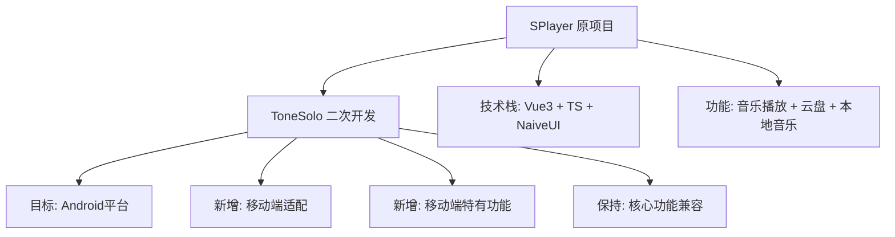
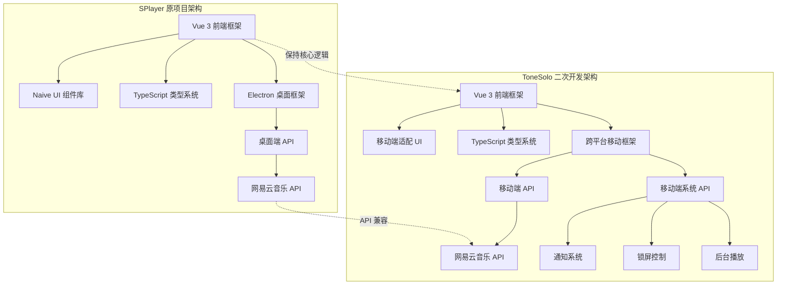

<div align="center">

<h2> ToneSolo </h2>
<p> 基于 SPlayer 二次开发的简约音乐播放器 </p>


>
> ### 🔥 二次开发项目声明
>
> 本项目是基于 [SPlayer](https://github.com/imsyy/SPlayer) 的二次开发项目，原项目作者为 [imsyy](https://github.com/imsyy)。
>
> 我们严格遵守原项目的 AGPL-3.0 许可协议，保留了所有原作者信息和版权声明。
>
> 本二次开发项目旨在将原项目改造为安卓版本，提供更多平台的使用选择。
>
> **查看原项目：** [SPlayer](https://github.com/imsyy/SPlayer) | **对比原项目：** [查看差异](#与原项目对比)

<br />
</div>

## 🆚 与原项目对比

| 特性 | SPlayer (原项目) | ToneSolo (二次开发) |
|------|----------------|-------------------|
| **开发框架** | Electron (桌面端) | 计划迁移至跨平台移动框架 |
| **目标平台** | Windows/macOS/Linux | Android (计划) |
| **UI/UX** | 桌面端界面 | 移动端优化界面 |
| **核心功能** | ✅ 完整 | ✅ 保持兼容 |
| **音乐播放** | ✅ 完整 | ✅ 保持兼容 |
| **本地音乐** | ✅ 支持 | ✅ 保持兼容 |
| **云盘功能** | ✅ 支持 | ✅ 保持兼容 |
| **歌词显示** | ✅ 支持 | ✅ 保持兼容 |
| **移动端适配** | ❌ 不支持 | 🚧 开发中 |
| **通知控制** | ❌ 不支持 | 📋 计划添加 |
| **锁屏控制** | ❌ 不支持 | 📋 计划添加 |
| **性能优化** | ✅ 桌面优化 | 🚧 移动端优化 |
| **数据存储** | 本地存储 | 移动端适配存储 |

### 二次开发路线图

- [ ] **第一阶段：移动端UI适配**
  - [ ] 响应式布局重构
  - [ ] 触控操作优化
  - [ ] 移动端导航设计

- [ ] **第二阶段：移动端功能增强**
  - [ ] 系统通知集成
  - [ ] 锁屏媒体控制
  - [ ] 后台播放优化

- [ ] **第三阶段：性能与体验优化**
  - [ ] 移动端性能调优
  - [ ] 电池使用优化
  - [ ] 网络状态适配

## 📖 二次开发说明

### 📊 项目衍生关系



ToneSolo 是基于 [SPlayer](https://github.com/imsyy/SPlayer) 的二次开发项目。SPlayer 是一个优秀的开源音乐播放器，由 [imsyy](https://github.com/imsyy) 开发，采用 [Vue 3](https://cn.vuejs.org/) + [TypeScript](https://www.typescriptlang.org/) + [Naïve UI](https://www.naiveui.com/) + [Electron](https://www.electronjs.org/zh/docs/latest/) 技术栈开发。

### 🎯 二次开发的主要目的与背景

本项目的主要目的是将原 SPlayer 改造为安卓版本，使更多用户能够在移动设备上使用这一优秀的音乐播放器。原 SPlayer 主要面向桌面平台，我们希望通过二次开发，将其功能扩展到移动平台，提供更广泛的使用场景。

### ✨ 新增功能或改进点

- 🚀 **计划添加安卓平台适配**
- 📱 **优化移动端用户界面和交互体验**
- ⚡ **针对移动设备进行性能优化**
- 🔔 **添加移动端特有功能（如通知控制、锁屏媒体控制等）**

### 🛠️ 技术架构调整

- **框架迁移**：原项目使用 Electron 框架，二次开发将考虑使用跨平台移动开发框架
- **UI层重构**：保持核心音乐播放逻辑不变，重构UI层以适应移动端
- **存储适配**：调整数据存储方案，适配移动端环境

### 🔄 与原项目的兼容性说明

- **数据格式兼容**：本项目保持与原 SPlayer 的数据格式兼容
- **功能完整支持**：支持原项目的所有核心功能
- **API接口一致**：保持与原项目相同的 API 接口，确保服务端兼容性

### 👥 二次开发部分的贡献者信息

- **主要开发者**：[xiaoleng-ros](https://github.com/xiaoleng-ros)
- **欢迎贡献**：欢迎更多开发者参与贡献，请参考 [贡献指南](docs/contributing.md)

### 📄 二次开发内容的使用许可说明

二次开发部分同样遵循 [GNU Affero General Public License (AGPL-3.0)](https://www.gnu.org/licenses/agpl-3.0.html) 许可协议。任何对本二次开发项目的修改和分发都必须基于 AGPL-3.0 进行，源代码必须一并提供。

### 🏗️ 项目架构图



### 📈 二次开发进度

| 阶段 | 任务 | 状态 | 进度 |
|------|------|------|------|
| **第一阶段** | 移动端UI适配 | 🚧 进行中 | 30% |
| | 响应式布局重构 | 🚧 进行中 | 40% |
| | 触控操作优化 | 📋 计划中 | 0% |
| | 移动端导航设计 | 📋 计划中 | 0% |
| **第二阶段** | 移动端功能增强 | 📋 计划中 | 0% |
| | 系统通知集成 | 📋 计划中 | 0% |
| | 锁屏媒体控制 | 📋 计划中 | 0% |
| | 后台播放优化 | 📋 计划中 | 0% |
| **第三阶段** | 性能与体验优化 | 📋 计划中 | 0% |
| | 移动端性能调优 | 📋 计划中 | 0% |
| | 电池使用优化 | 📋 计划中 | 0% |
| | 网络状态适配 | 📋 计划中 | 0% |

- 欢迎各位大佬 `Star` 😍

> [!NOTE]
> 本二次开发项目（ToneSolo）计划将原项目改造为安卓版本，提供移动端支持。

## 🎉 功能

- ✨ 支持扫码登录
- 📱 支持手机号登录
- 📅 自动进行每日签到及云贝签到
- 💻 支持桌面歌词
- 💻 支持切换为本地播放器，此模式将不会连接网络
- 🎨 封面主题色自适应，支持全站着色
- 🌚 Light / Dark / Auto 模式自动切换
- 📁 本地歌曲管理及分类（建议先使用 [音乐标签](https://www.cnblogs.com/vinlxc/p/11347744.html) 进行匹配后再使用）
- 📁 简易的本地音乐标签编辑及封面修改
- 🎵 **支持播放部分无版权歌曲（可能会与原曲不匹配，客户端独占功能）**
- ⬇️ 下载歌曲 / 批量下载（ 最高支持 Hi-Res，需具有相应会员账号 ）
- ➕ 新建歌单及歌单编辑
- ❤️ 收藏 / 取消收藏歌单或歌手
- 🎶 每日推荐歌曲
- 📻 私人 FM
- ☁️ 云盘音乐上传
- 📂 云盘内歌曲播放
- 🔄 云盘内歌曲纠正
- 🗑️ 云盘歌曲删除
- 📝 支持逐字歌词
- 🔄 歌词滚动以及歌词翻译
- 📹 MV 与视频播放
- 🎶 音乐频谱显示
- ⏭️ 音乐渐入渐出
- 🔄 支持 PWA
- 💬 支持评论区
- 🎵 支持 Last.fm Scrobble（播放记录上报）

## 🤝 参与二次开发

### 📋 贡献指南

我们欢迎所有形式的贡献，无论是代码、文档、问题反馈还是功能建议。以下是参与二次开发的指南：

#### 🔄 与原项目保持同步

由于本项目是基于SPlayer的二次开发，我们需要：

1. **定期同步原项目更新**
   ```bash
   git remote add upstream https://github.com/imsyy/SPlayer.git
   git fetch upstream
   git merge upstream/main
   ```

2. **保持核心功能兼容性**
   - 所有核心功能必须与原项目保持兼容
   - API接口不得破坏原有兼容性
   - 数据格式必须保持一致

3. **遵循原项目代码风格**
   - 遵循原项目的代码规范
   - 保持与原项目一致的命名约定
   - 使用相同的依赖管理方式

#### 🚀 二次开发贡献流程

1. **Fork 本仓库**
   - 点击右上角 Fork 按钮
   - 克隆你的 Fork 版本

2. **创建功能分支**
   ```bash
   git checkout -b feature/你的功能名称
   ```

3. **开发和测试**
   - 确保代码符合二次开发目标
   - 测试移动端兼容性
   - 验证与原项目的兼容性

4. **提交 Pull Request**
   - 详细描述你的更改
   - 说明对二次开发的价值
   - 提供测试结果

#### 📝 开发规范

- **代码风格**：遵循原项目的 ESLint 配置
- **提交信息**：使用语义化提交格式
- **测试要求**：确保所有测试通过
- **文档更新**：更新相关文档和注释

#### 🎯 二次开发重点领域

我们特别欢迎以下领域的贡献：

- 📱 **移动端UI/UX改进**
- ⚡ **移动端性能优化**
- 🔔 **移动端系统集成**
- 🎨 **移动端主题和样式**
- 📚 **移动端使用文档**

### 📞 联系方式

- **问题反馈**：[Issues](https://github.com/xiaoleng-ros/ToneSolo/issues)
- **功能建议**：[Discussions](https://github.com/xiaoleng-ros/ToneSolo/discussions)
- **开发交流**：[xiaoleng-ros](https://github.com/xiaoleng-ros)

## 😘 鸣谢

特此感谢为本项目提供支持与灵感的项目：

- [SPlayer](https://github.com/imsyy/SPlayer)
- [NeteaseCloudMusicApi](https://github.com/Binaryify/NeteaseCloudMusicApi)
- [YesPlayMusic](https://github.com/qier222/YesPlayMusic)
- [UnblockNeteaseMusic](https://github.com/UnblockNeteaseMusic/server)
- [applemusic-like-lyrics](https://github.com/Steve-xmh/applemusic-like-lyrics)
- [Vue-mmPlayer](https://github.com/maomao1996/Vue-mmPlayer)
- [refined-now-playing-netease](https://github.com/solstice23/refined-now-playing-netease)
- [material-color-utilities](https://github.com/material-foundation/material-color-utilities)

##  免责声明

本项目部分功能使用了网易云音乐的第三方 API 服务，**仅供个人学习研究使用，禁止用于商业及非法用途**

同时，本项目开发者承诺 **严格遵守相关法律法规和网易云音乐 API 使用协议，不会利用本项目进行任何违法活动。** 如因使用本项目而引起的任何纠纷或责任，均由使用者自行承担。**本项目开发者不承担任何因使用本项目而导致的任何直接或间接责任，并保留追究使用者违法行为的权利**

请使用者在使用本项目时遵守相关法律法规，**不要将本项目用于任何商业及非法用途。如有违反，一切后果由使用者自负。** 同时，使用者应该自行承担因使用本项目而带来的风险和责任。本项目开发者不对本项目所提供的服务和内容做出任何保证

感谢您的理解

## 📜 开源许可

### 原项目许可

- **原项目仅供个人学习研究使用，禁止用于商业及非法用途**
- 原项目基于 [GNU Affero General Public License (AGPL-3.0)](https://www.gnu.org/licenses/agpl-3.0.html) 许可进行开源
  1. **修改和分发：** 任何对原项目的修改和分发都必须基于 AGPL-3.0 进行，源代码必须一并提供
  2. **派生作品：** 任何派生作品必须同样采用 AGPL-3.0，并在适当的地方注明原始项目的许可证
  3. **注明原作者：** 在任何修改、派生作品或其他分发中，必须在适当的位置明确注明原作者及其贡献
  4. **免责声明：** 根据 AGPL-3.0，原项目不提供任何明示或暗示的担保。请详细阅读 [GNU Affero General Public License (AGPL-3.0)](https://www.gnu.org/licenses/agpl-3.0.html) 以了解完整的免责声明内容
  5. **社区参与：** 欢迎社区的参与和贡献，我们鼓励开发者一同改进和维护原项目
  6. **许可证链接：** 请阅读 [GNU Affero General Public License (AGPL-3.0)](https://www.gnu.org/licenses/agpl-3.0.html) 了解更多详情

### 二次开发项目许可

- **二次开发项目同样仅供个人学习研究使用，禁止用于商业及非法用途**
- 二次开发项目同样基于 [GNU Affero General Public License (AGPL-3.0)](https://www.gnu.org/licenses/agpl-3.0.html) 许可进行开源
- 二次开发项目保留了原项目的所有版权信息和许可声明
- 任何对本二次开发项目的修改和分发都必须基于 AGPL-3.0 进行，源代码必须一并提供
- 在使用本二次开发项目时，必须同时遵守原项目的许可协议和二次开发项目的许可协议
